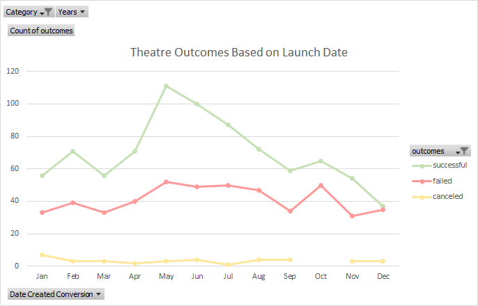
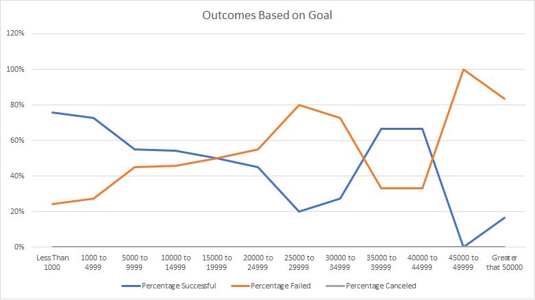

# Kickstarting with Excel

## Overview of Project

Louise is a playwrite wanting to start a crowdfunding campaign. She has estimated a budget of over $10,000. She wants to gain an understanding of what factors make a successful campaign.

Specifically, Louise wants to understand if and how the launch dates and funding goals of different campaigns effected their outcomes.

### Purpose
The purpose of this project is to analyze and create visuals that depict the above referenced information.

## Analysis and Challenges
All analysis are available in the [Kickstarter Challenge Workbook](./Kickstarter_Challenge.xlsx).  

### Analysis of Outcomes Based on Launch Date
The Theatre campaigns based on launch month was charted to show the months with the highest number of successes.  
  

### Analysis of Outcomes Based on Goals
To visualize the effect of goal amounts on the outcomes of Play campaigns, set ranges of goal amounts were plotted against the percentage of successful and failed campaigns.  
 

### Challenges and Difficulties Encountered
- The only issues were in learning how GitHub works and using the markdown language.
  * The most challenging was figuring out how to include the images.  
- Data analysis in Excel is straightforward. Some possible challenges include:
  * Using and understanding formulas might be challenging.
  * Understanding pivot tables takes some experimentation, but the instructions were very straightforward.  
## Results
- What are two conclusions you can draw about the Outcomes based on Launch Date?
1. There is a spike in successful outcomes within the Theatre category where the campaigns were started in the month of May which corresponds to the higher numbers of campaigns started in that month.
2. The launch month with the least number of successful outcomes is December which also corresponds to the lowest number of campaign starts.
  
- What can you conclude about the Outcomes based on Goals?
  * The campaigns that had goals of less than $5,000 were more likely to have a successful outcome.
  * None of the campaigns in the "play" category were canceled.
  * One-third of the campaigns in the play subcatagory failed
  
- What are some limitations of this dataset?
  * This data is only from the Kickstarter platform. There are other platforms some of which may have more data in the Theatre category and the Play subcategory.
    - Comparing the outcomes on different platforms could show if there is a better platform to launch on.
    - Pulling the launch date from all of the platforms would give an even better idea if there is a trend in successful outcomes. If different platforms have different successful months, the required launch date could determine what platform to use.
  * Information on how each of the campaigns were marketed would give an idea of where to focus efforts.
  * The outcome vs. goal does not take into account the different currency rates.
  * There is no information on fees and how much this will effect the total funds raised.
  
- What are some other possible tables and/or graphs that we could create?
  * Plotting outcomes based on the length of the campaign would give an idea if there is a more ideal duration of a campaign.
  * With a quick glance at the outcomes against the "spotlight" column, it looks like campaigns that used the "spotlight" function generally had successful outcomes. It might be worth it to analyze the campaigns that used this "spotlight".
